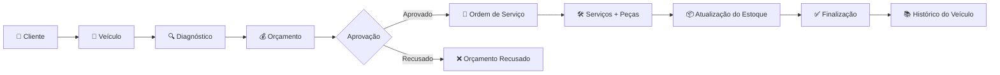
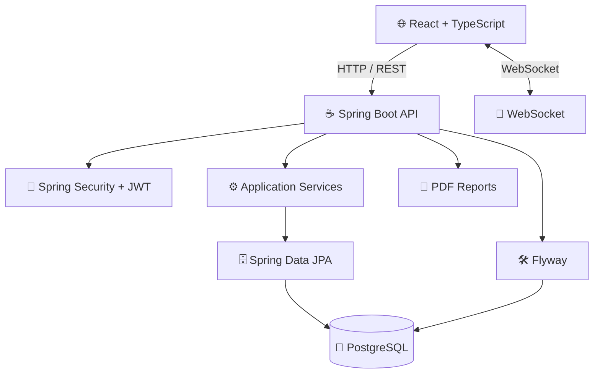
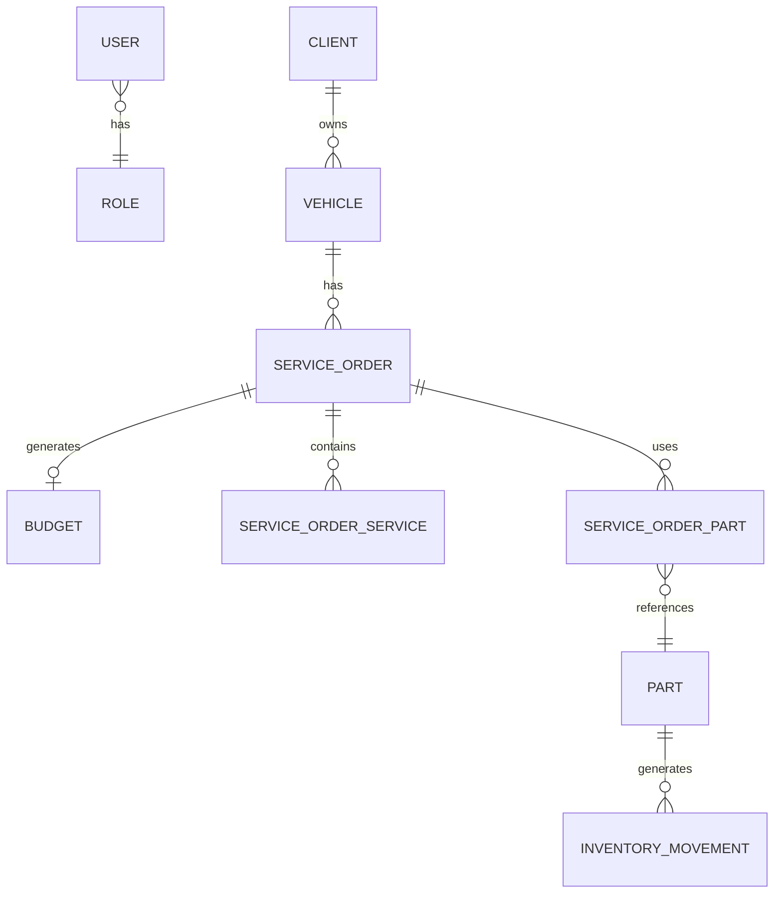

<div align="center">

# 🚗 AutoCare

### Sistema de Gestão de Oficina Mecânica

**Plataforma Full Stack para gerenciamento de clientes, veículos, ordens de serviço, orçamentos, estoque e operações de uma oficina mecânica.**

<br />


<br />


<br />

[📋 Funcionalidades](#-funcionalidades) •
[🏗️ Arquitetura](#️-arquitetura) •
[🚀 Instalação](#-como-executar) •
[📡 API](#-api-rest) •
[🧪 Testes](#-testes)

</div>

---

## 📋 Sobre o Projeto

O **AutoCare** é uma aplicação **Full Stack** desenvolvida para digitalizar e centralizar a gestão operacional de oficinas mecânicas.

A plataforma acompanha todo o ciclo de atendimento, desde o cadastro do cliente e veículo até diagnóstico, orçamento, aprovação, execução dos serviços, controle de peças e finalização da ordem de serviço.

O projeto foi desenvolvido com foco em **boas práticas de desenvolvimento**, **segurança**, **arquitetura modular**, **persistência relacional**, **controle de acesso**, **comunicação em tempo real** e **escalabilidade**.

### 🎯 Fluxo Principal



---

# ✨ Funcionalidades

## 👥 Gestão de Clientes

* Cadastro completo de clientes
* Busca por nome e CPF
* Visualização de veículos vinculados
* Histórico de serviços realizados
* Ativação e desativação de clientes
* Soft delete

## 🚗 Gestão de Veículos

* Cadastro de veículos vinculados a clientes
* Validação de placas no padrão Mercosul
* Controle de quilometragem
* Histórico de manutenções
* Consulta de veículos por cliente

## 🔧 Ordens de Serviço

* Criação e gerenciamento de ordens de serviço
* Máquina de estados com transições controladas
* Atribuição de mecânicos
* Registro de diagnóstico
* Registro de problemas identificados
* Controle dos serviços executados
* Controle das peças utilizadas

### 🔄 Estados da Ordem de Serviço

```text
CRIADA
   ↓
EM_DIAGNOSTICO
   ↓
AGUARDANDO_APROVACAO
   ↓
APROVADA
   ↓
EM_EXECUCAO
   ↓
FINALIZADA
```

As transições são validadas pela aplicação para evitar alterações de estado inconsistentes.

---

## 💰 Orçamentos

* Criação de orçamentos vinculados às ordens de serviço
* Inclusão de serviços e peças
* Cálculo dos valores
* Aprovação pelo cliente
* Recusa do orçamento
* Controle de status

### Status

```text
PENDENTE
APROVADO
RECUSADO
```

---

## 👨‍🔧 Gestão de Mecânicos

* Cadastro de mecânicos
* Definição de especialidades
* Controle de disponibilidade
* Atribuição às ordens de serviço
* Histórico de serviços realizados

---

## 🔩 Controle de Estoque

* Cadastro de peças
* Código único por peça
* Controle de quantidade disponível
* Definição de estoque mínimo
* Entrada de peças
* Saída de peças
* Ajustes de estoque
* Histórico de movimentações
* Auditoria das movimentações
* Validação contra estoque insuficiente
* Operações transacionais

### Tipos de Movimentação

| Tipo      | Descrição                   |
| --------- | --------------------------- |
| `ENTRADA` | Entrada de peças no estoque |
| `SAIDA`   | Saída de peças              |
| `AJUSTE`  | Correção manual do estoque  |

---

## 📊 Dashboard

Dashboard operacional com:

* Indicadores gerais
* Métricas de operação
* Faturamento mensal
* Ranking de mecânicos
* Alertas de estoque baixo
* Atualizações em tempo real
* Integração com WebSocket

---

## 🔐 Autenticação e Autorização

O sistema utiliza **Spring Security + JWT** para autenticação e controle de acesso baseado em funções.

### Perfis de Acesso

| Perfil         | Permissões                                             |
| -------------- | ------------------------------------------------------ |
| `ADMIN`        | Acesso completo ao sistema                             |
| `MANAGER`      | Dashboard, relatórios, ordens e estoque                |
| `RECEPTIONIST` | Clientes, veículos, ordens e orçamentos                |
| `MECHANIC`     | Ordens atribuídas, diagnóstico e atualização de status |

### Recursos de Segurança

* JWT Authentication
* Refresh Token
* Role-Based Access Control
* Autorização por perfil
* Proteção de endpoints
* Validação de dados
* Controle de acesso às operações

---

## 📄 Relatórios

Geração de documentos em PDF para:

* Orçamentos
* Ordens de serviço
* Notas de serviço

---

## 🔔 Comunicação em Tempo Real

O AutoCare utiliza **WebSocket** para comunicação em tempo real.

Entre os eventos suportados:

* Atualização de status de ordens
* Criação de orçamentos
* Atualização do dashboard
* Notificações operacionais

---

# 🏗️ Arquitetura

O projeto foi estruturado separando claramente **backend** e **frontend**, permitindo evolução e implantação independentes.



### Organização do Backend

O backend segue uma organização modular por domínio:

```text
com.autocare
│
├── config
│
├── shared
│
├── auth
│
├── client
│
├── vehicle
│
├── mechanic
│
├── serviceorder
│
├── budget
│
├── inventory
│
├── dashboard
│
└── report
```

Essa abordagem facilita:

* Manutenção
* Separação de responsabilidades
* Evolução dos módulos
* Testabilidade
* Organização do domínio

---

# 🛠️ Stack Tecnológica

## Backend

| Tecnologia        |  Versão | Finalidade              |
| ----------------- | ------: | ----------------------- |
| Java              |      21 | Linguagem principal     |
| Spring Boot       |   3.2.0 | Framework da aplicação  |
| Spring Security   |   3.2.0 | Segurança e autorização |
| Spring Data JPA   |   3.2.0 | Persistência e ORM      |
| PostgreSQL        |      16 | Banco de dados          |
| Flyway            |  10.0.0 | Migrações               |
| JWT               |  0.11.5 | Autenticação            |
| Lombok            | 1.18.30 | Redução de boilerplate  |
| OpenAPI / Swagger |   2.3.0 | Documentação da API     |
| JUnit 5           |  5.10.0 | Testes                  |
| Mockito           |   5.6.0 | Mocking                 |
| Docker            |  24.0.0 | Containerização         |

## Frontend

| Tecnologia      | Versão | Finalidade              |
| --------------- | -----: | ----------------------- |
| React           | 18.2.0 | Interface               |
| TypeScript      |  5.0.0 | Tipagem estática        |
| Vite            |  4.4.0 | Build e desenvolvimento |
| Tailwind CSS    |  3.3.0 | Estilização             |
| React Router    | 6.20.0 | Roteamento              |
| React Hook Form | 7.48.0 | Formulários             |
| TanStack Query  | 5.12.0 | Estado assíncrono       |
| Axios           |  1.6.0 | HTTP Client             |
| Recharts        | 2.10.0 | Visualização de dados   |
| Zod             | 3.22.0 | Validação               |
| React Hot Toast |  2.4.0 | Notificações            |

---

# 📁 Estrutura do Projeto

```text
autocare/
│
├── backend/
│   ├── src/
│   │   ├── main/
│   │   │   ├── java/com/autocare/
│   │   │   │   ├── config/
│   │   │   │   ├── shared/
│   │   │   │   ├── auth/
│   │   │   │   ├── client/
│   │   │   │   ├── vehicle/
│   │   │   │   ├── mechanic/
│   │   │   │   ├── serviceorder/
│   │   │   │   ├── budget/
│   │   │   │   ├── inventory/
│   │   │   │   ├── dashboard/
│   │   │   │   ├── report/
│   │   │   │   └── AutoCareApplication.java
│   │   │   │
│   │   │   └── resources/
│   │   │       ├── application.yml
│   │   │       ├── application-dev.yml
│   │   │       └── db/migration/
│   │   │
│   │   └── test/
│   │
│   ├── Dockerfile
│   ├── pom.xml
│   └── .env.example
│
├── frontend/
│   ├── src/
│   │   ├── api/
│   │   ├── components/
│   │   │   ├── common/
│   │   │   ├── auth/
│   │   │   ├── dashboard/
│   │   │   ├── clients/
│   │   │   ├── vehicles/
│   │   │   ├── mechanics/
│   │   │   ├── serviceOrders/
│   │   │   ├── budgets/
│   │   │   └── inventory/
│   │   ├── contexts/
│   │   ├── hooks/
│   │   ├── pages/
│   │   ├── routes/
│   │   ├── types/
│   │   └── utils/
│   │
│   ├── Dockerfile
│   ├── package.json
│   └── vite.config.ts
│
├── docker-compose.yml
├── docker-compose.prod.yml
├── .gitignore
└── README.md
```

---

# 🚀 Como Executar

## Pré-requisitos

### Opção recomendada

* Docker
* Docker Compose

### Desenvolvimento local

* Java 21+
* Maven 3.9+
* Node.js 20+
* PostgreSQL 16+

---

## 🐳 Docker

Clone o projeto:

```bash
git clone https://github.com/adanwilliamdev/autocare.git
cd autocare
```

Inicie os containers:

```bash
docker-compose up -d
```

A aplicação estará disponível em:

| Serviço  | URL                                       |
| -------- | ----------------------------------------- |
| Frontend | http://localhost                          |
| Backend  | http://localhost:8080                     |
| API      | http://localhost:8080/api                 |
| Swagger  | http://localhost:8080/api/swagger-ui.html |

Para acompanhar os logs:

```bash
docker-compose logs -f
```

Para parar os containers:

```bash
docker-compose down
```

---

# 💻 Desenvolvimento Local

## Backend

Entre no diretório:

```bash
cd backend
```

Configure as variáveis de ambiente:

```bash
cp .env.example .env
```

Compile o projeto:

```bash
./mvnw clean install
```

Execute a aplicação:

```bash
./mvnw spring-boot:run
```

### PostgreSQL via Docker

Caso queira executar somente o banco através do Docker:

```bash
docker run -d \
  --name autocare-postgres \
  -e POSTGRES_DB=autocare \
  -e POSTGRES_USER=autocare \
  -e POSTGRES_PASSWORD=autocare123 \
  -p 5432:5432 \
  postgres:16-alpine
```

---

## Frontend

Entre no diretório:

```bash
cd frontend
```

Instale as dependências:

```bash
npm install
```

Configure as variáveis de ambiente:

```bash
cp .env.example .env
```

Execute o servidor de desenvolvimento:

```bash
npm run dev
```

---

# 🔑 Credenciais de Demonstração

> ⚠️ **Atenção:** as credenciais abaixo são destinadas exclusivamente ao ambiente de desenvolvimento/demonstração. Nunca utilize senhas padrão em produção.

| Email                       | Senha      | Perfil         |
| --------------------------- | ---------- | -------------- |
| `admin@autocare.com`        | `admin123` | `ADMIN`        |
| `manager@autocare.com`      | `admin123` | `MANAGER`      |
| `receptionist@autocare.com` | `admin123` | `RECEPTIONIST` |
| `mechanic@autocare.com`     | `admin123` | `MECHANIC`     |

---

# 📡 API REST

A API é organizada por recursos de domínio e segue os princípios REST.

## 🔐 Autenticação

| Método | Endpoint             | Descrição          |
| ------ | -------------------- | ------------------ |
| `POST` | `/api/auth/login`    | Autenticar usuário |
| `POST` | `/api/auth/register` | Registrar usuário  |

## 👥 Clientes

| Método   | Endpoint                     | Descrição         |
| -------- | ---------------------------- | ----------------- |
| `GET`    | `/api/clients`               | Listar clientes   |
| `GET`    | `/api/clients/{id}`          | Buscar cliente    |
| `GET`    | `/api/clients/search?name=`  | Buscar por nome   |
| `POST`   | `/api/clients`               | Criar cliente     |
| `PUT`    | `/api/clients/{id}`          | Atualizar cliente |
| `DELETE` | `/api/clients/{id}`          | Excluir cliente   |
| `PATCH`  | `/api/clients/{id}/activate` | Ativar cliente    |

## 🚗 Veículos

| Método   | Endpoint                          | Descrição               |
| -------- | --------------------------------- | ----------------------- |
| `GET`    | `/api/vehicles`                   | Listar veículos         |
| `GET`    | `/api/vehicles/{id}`              | Buscar veículo          |
| `GET`    | `/api/vehicles/client/{clientId}` | Veículos do cliente     |
| `POST`   | `/api/vehicles`                   | Criar veículo           |
| `PUT`    | `/api/vehicles/{id}`              | Atualizar veículo       |
| `PATCH`  | `/api/vehicles/{id}/mileage`      | Atualizar quilometragem |
| `DELETE` | `/api/vehicles/{id}`              | Excluir veículo         |

## 🔧 Ordens de Serviço

| Método  | Endpoint                                | Descrição          |
| ------- | --------------------------------------- | ------------------ |
| `GET`   | `/api/service-orders`                   | Listar ordens      |
| `GET`   | `/api/service-orders/{id}`              | Buscar ordem       |
| `GET`   | `/api/service-orders/client/{clientId}` | Ordens do cliente  |
| `GET`   | `/api/service-orders/status/{status}`   | Filtrar por status |
| `POST`  | `/api/service-orders`                   | Criar ordem        |
| `PATCH` | `/api/service-orders/{id}/status`       | Atualizar status   |
| `PATCH` | `/api/service-orders/{id}/mechanic`     | Atribuir mecânico  |

## 💰 Orçamentos

| Método  | Endpoint                         | Descrição             |
| ------- | -------------------------------- | --------------------- |
| `GET`   | `/api/budgets`                   | Listar orçamentos     |
| `GET`   | `/api/budgets/{id}`              | Buscar orçamento      |
| `GET`   | `/api/budgets/client/{clientId}` | Orçamentos do cliente |
| `GET`   | `/api/budgets/status/{status}`   | Filtrar por status    |
| `POST`  | `/api/budgets`                   | Criar orçamento       |
| `PATCH` | `/api/budgets/{id}/approve`      | Aprovar orçamento     |
| `PATCH` | `/api/budgets/{id}/reject`       | Recusar orçamento     |

## 🔩 Estoque

| Método   | Endpoint                                 | Descrição               |
| -------- | ---------------------------------------- | ----------------------- |
| `GET`    | `/api/inventory/parts`                   | Listar peças            |
| `GET`    | `/api/inventory/parts/low-stock`         | Peças com estoque baixo |
| `GET`    | `/api/inventory/parts/{id}`              | Buscar peça             |
| `GET`    | `/api/inventory/parts/{id}/movements`    | Movimentações           |
| `POST`   | `/api/inventory/parts`                   | Criar peça              |
| `PUT`    | `/api/inventory/parts/{id}`              | Atualizar peça          |
| `DELETE` | `/api/inventory/parts/{id}`              | Excluir peça            |
| `POST`   | `/api/inventory/parts/{id}/add-stock`    | Adicionar estoque       |
| `POST`   | `/api/inventory/parts/{id}/remove-stock` | Remover estoque         |

## 📊 Dashboard

| Método | Endpoint               | Descrição                 |
| ------ | ---------------------- | ------------------------- |
| `GET`  | `/api/dashboard/stats` | Estatísticas do dashboard |

---

# 🗄️ Modelo de Dados



### Principais relacionamentos

```text
USER
 └── ROLE

CLIENT
 └── VEHICLE
      └── SERVICE_ORDER
           ├── BUDGET
           ├── SERVICE_ORDER_SERVICE
           └── SERVICE_ORDER_PART
                └── PART
                     └── INVENTORY_MOVEMENT
```

---

# 🧪 Testes

## Backend

```bash
cd backend

./mvnw test
```

Para executar com relatório detalhado:

```bash
./mvnw test -DtrimStackTrace=false
```

## Frontend

```bash
cd frontend

npm test
```

A estratégia de testes contempla principalmente:

* Regras de negócio
* Serviços
* Validações
* Autenticação
* Controle de acesso
* Integrações críticas

---

# 📦 Build para Produção

## Backend

```bash
cd backend

./mvnw clean package -DskipTests
```

O artefato será gerado no diretório:

```text
backend/target/
```

## Frontend

```bash
cd frontend

npm run build
```

Os arquivos de produção serão gerados em:

```text
frontend/dist/
```

---

# 🐳 Produção com Docker

O projeto possui configuração específica para ambiente produtivo:

```bash
docker-compose -f docker-compose.prod.yml up -d
```

Para encerrar:

```bash
docker-compose -f docker-compose.prod.yml down
```

---

# 📚 Documentação da API

Após iniciar o backend, a documentação interativa pode ser acessada através do **Swagger UI**:

```text
http://localhost:8080/api/swagger-ui.html
```

A documentação permite visualizar:

* Endpoints
* Métodos HTTP
* Parâmetros
* Schemas
* Respostas
* Códigos HTTP
* Autenticação

---

# 🔄 Fluxo de Negócio

O fluxo principal da aplicação pode ser resumido em:

```text
┌───────────────┐
│    CLIENTE    │
└───────┬───────┘
        ↓
┌───────────────┐
│    VEÍCULO    │
└───────┬───────┘
        ↓
┌───────────────┐
│  DIAGNÓSTICO  │
└───────┬───────┘
        ↓
┌───────────────┐
│   ORÇAMENTO   │
└───────┬───────┘
        ↓
   ┌────┴────┐
   │         │
APROVADO   RECUSADO
   │
   ↓
┌───────────────┐
│      OS       │
└───────┬───────┘
        ↓
┌───────────────┐
│ SERVIÇOS/PEÇAS│
└───────┬───────┘
        ↓
┌───────────────┐
│    ESTOQUE    │
└───────┬───────┘
        ↓
┌───────────────┐
│  FINALIZAÇÃO  │
└───────┬───────┘
        ↓
┌───────────────┐
│   HISTÓRICO   │
└───────────────┘
```

---

# 🤝 Contribuição

Contribuições são bem-vindas.

### 1. Faça um Fork

```bash
git clone https://github.com/seu-usuario/autocare.git
```

### 2. Crie uma branch

```bash
git checkout -b feature/minha-feature
```

### 3. Faça suas alterações

```bash
git add .
git commit -m "feat: adiciona nova funcionalidade"
```

### 4. Envie para o repositório

```bash
git push origin feature/minha-feature
```

### 5. Abra um Pull Request

Descreva claramente:

* O problema resolvido
* A solução implementada
* Alterações realizadas
* Testes executados

---

# 📌 Boas Práticas Adotadas

O projeto busca aplicar princípios e práticas comuns no desenvolvimento profissional:

* **Clean Code**
* **SOLID**
* **RESTful API**
* **Domain-oriented organization**
* **Separation of Concerns**
* **DTOs**
* **Validação de dados**
* **Tratamento global de exceções**
* **Transações**
* **Database migrations**
* **JWT Authentication**
* **RBAC**
* **Testes automatizados**
* **Containerização com Docker**
* **Documentação com OpenAPI**
* **Comunicação em tempo real com WebSocket**

---

# 🗺️ Roadmap

Possíveis evoluções do projeto:

* [ ] Sistema de agendamento de serviços
* [ ] Integração com gateway de pagamentos
* [ ] Envio de notificações por WhatsApp
* [ ] Histórico financeiro completo
* [ ] Controle de fornecedores
* [ ] Gestão de compras
* [ ] Indicadores financeiros avançados
* [ ] Auditoria completa de operações
* [ ] Testes de integração
* [ ] Testes E2E
* [ ] CI/CD com GitHub Actions
* [ ] Observabilidade com métricas e logs
* [ ] Deploy em cloud

---

# 📄 Licença

Este projeto está licenciado sob a **MIT License**.

Consulte o arquivo [`LICENSE`](LICENSE) para mais informações.

---

# 👨‍💻 Autor

Desenvolvido por **Adan William** como projeto de portfólio com foco em **Java Backend, Spring Boot, APIs REST, React e arquitetura Full Stack**.

### Tecnologias em destaque

`Java` `Spring Boot` `Spring Security` `PostgreSQL` `React` `TypeScript` `Docker` `JWT` `WebSocket`

---

<div align="center">

### 🚗 AutoCare

**Gestão inteligente para oficinas mecânicas.**

⭐ Se este projeto foi útil ou interessante, considere deixar uma estrela no repositório.

</div>
