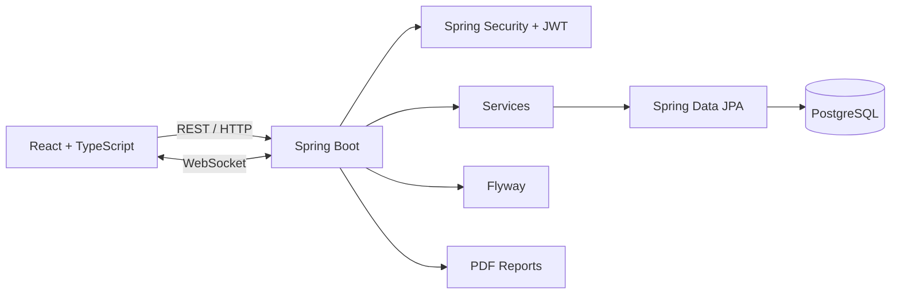
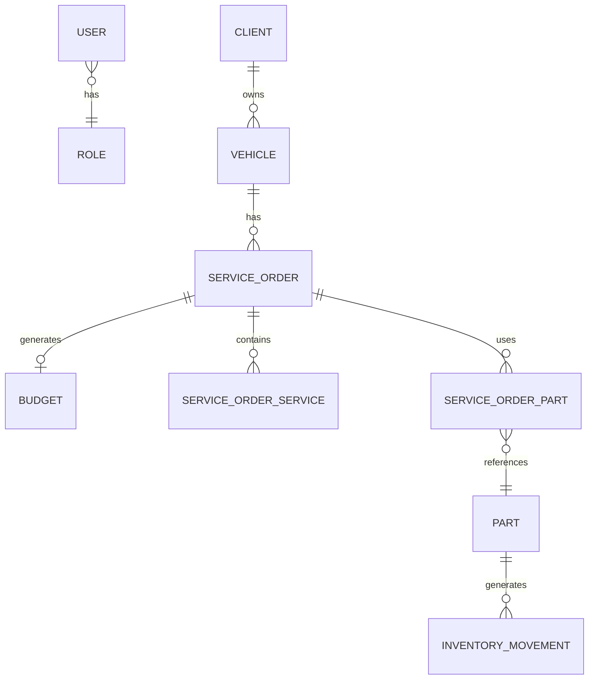

<div align="center">

# 🚗 AutoCare

### Sistema de Gestão de Oficina Mecânica

**Plataforma Full Stack para gerenciamento de clientes, veículos, ordens de serviço, orçamentos, estoque e operações de oficinas mecânicas.**

<br>


<br>

**Spring Security + JWT · Flyway · OpenAPI · WebSocket · JPA · REST**

</div>

---

## 📋 Sobre o Projeto

O **AutoCare** é um sistema Full Stack desenvolvido para digitalizar a operação de oficinas mecânicas.

A aplicação centraliza o gerenciamento de **clientes, veículos, mecânicos, ordens de serviço, orçamentos, peças e estoque**, acompanhando o processo desde o diagnóstico até a finalização do serviço.

O projeto foi desenvolvido com foco em **arquitetura modular, segurança, boas práticas, regras de negócio, persistência relacional e comunicação em tempo real**.

### 🔄 Fluxo principal

```text
Cliente
   ↓
Veículo
   ↓
Diagnóstico
   ↓
Orçamento
   ↓
Aprovação
   ↓
Ordem de Serviço
   ↓
Serviços + Peças
   ↓
Estoque
   ↓
Finalização
   ↓
Histórico
```

---

# ✨ Funcionalidades

### 👥 Clientes e Veículos

* Cadastro e gerenciamento de clientes
* Cadastro de veículos vinculados
* Busca por nome e CPF
* Validação de placas Mercosul
* Controle de quilometragem
* Histórico de serviços

### 🔧 Ordens de Serviço

* Criação e gerenciamento de OS
* Diagnóstico e registro de problemas
* Atribuição de mecânicos
* Controle de serviços e peças
* Máquina de estados com transições controladas

```text
CRIADA
  ↓
EM_DIAGNOSTICO
  ↓
AGUARDANDO_APROVACAO
  ↓
APROVADA
  ↓
EM_EXECUCAO
  ↓
FINALIZADA
```

### 💰 Orçamentos

* Criação de orçamentos
* Serviços e peças
* Cálculo automático de valores
* Aprovação ou recusa
* Controle de status

### 🔩 Estoque

* Cadastro de peças
* Entrada, saída e ajustes
* Estoque mínimo
* Alertas de estoque baixo
* Histórico de movimentações
* Auditoria
* Validação contra estoque insuficiente
* Operações transacionais

### 📊 Dashboard

* Indicadores operacionais
* Faturamento mensal
* Ranking de mecânicos
* Alertas de estoque
* Atualizações em tempo real

### 🔐 Segurança

* Spring Security
* JWT + Refresh Token
* Role-Based Access Control
* Proteção de endpoints
* Validação de dados
* Controle de acesso por perfil

| Perfil         | Acesso                              |
| -------------- | ----------------------------------- |
| `ADMIN`        | Acesso completo                     |
| `MANAGER`      | Dashboard, relatórios, OS e estoque |
| `RECEPTIONIST` | Clientes, veículos, OS e orçamentos |
| `MECHANIC`     | OS atribuídas e diagnóstico         |

### 📄 Relatórios e Tempo Real

* Geração de documentos PDF
* Relatórios de orçamento e OS
* WebSocket para atualizações em tempo real
* Notificações operacionais
* Atualização de status e dashboard

---

# 🏗️ Arquitetura



### Organização do Backend

Arquitetura modular orientada por domínio:

```text
com.autocare
├── config
├── shared
├── auth
├── client
├── vehicle
├── mechanic
├── serviceorder
├── budget
├── inventory
├── dashboard
└── report
```

Essa estrutura favorece **separação de responsabilidades, manutenção, testabilidade e evolução do sistema**.

---

# 🛠️ Stack

## Backend

| Tecnologia        | Finalidade                 |
| ----------------- | -------------------------- |
| Java 21           | Linguagem principal        |
| Spring Boot 3.2   | Framework                  |
| Spring Security   | Autenticação e autorização |
| Spring Data JPA   | Persistência               |
| PostgreSQL 16     | Banco de dados             |
| Flyway            | Migrações                  |
| JWT               | Autenticação               |
| OpenAPI / Swagger | Documentação               |
| JUnit 5 + Mockito | Testes                     |
| Docker            | Containerização            |

## Frontend

| Tecnologia     | Finalidade        |
| -------------- | ----------------- |
| React 18       | Interface         |
| TypeScript 5   | Tipagem           |
| Vite           | Build             |
| Tailwind CSS   | Estilização       |
| React Router   | Roteamento        |
| TanStack Query | Estado assíncrono |
| Axios          | HTTP Client       |
| Recharts       | Gráficos          |
| Zod            | Validação         |

---

# 📁 Estrutura

```text
autocare/
├── backend/
│   ├── src/main/java/com/autocare/
│   ├── src/main/resources/
│   ├── src/test/
│   ├── Dockerfile
│   └── pom.xml
│
├── frontend/
│   ├── src/
│   ├── Dockerfile
│   └── package.json
│
├── docker-compose.yml
├── docker-compose.prod.yml
└── README.md
```

---

# 🚀 Como Executar

## 🐳 Docker

### Pré-requisitos

* Docker
* Docker Compose

Clone o repositório:

```bash
git clone https://github.com/adanwilliamdev/autocare.git
cd autocare
```

Inicie a aplicação:

```bash
docker-compose up -d
```

Serviços:

| Serviço  | Endereço                                  |
| -------- | ----------------------------------------- |
| Frontend | http://localhost                          |
| Backend  | http://localhost:8080                     |
| API      | http://localhost:8080/api                 |
| Swagger  | http://localhost:8080/api/swagger-ui.html |

Logs:

```bash
docker-compose logs -f
```

Parar:

```bash
docker-compose down
```

---

# 💻 Desenvolvimento Local

### Backend

Requisitos:

* Java 21+
* Maven 3.9+
* PostgreSQL 16+

```bash
cd backend

./mvnw clean install
./mvnw spring-boot:run
```

### Frontend

Requisitos:

* Node.js 20+

```bash
cd frontend

npm install
npm run dev
```

---

# 🔑 Credenciais de Demonstração

> ⚠️ Disponíveis apenas para desenvolvimento/demonstração.

| Usuário                     | Senha      | Perfil       |
| --------------------------- | ---------- | ------------ |
| `admin@autocare.com`        | `admin123` | ADMIN        |
| `manager@autocare.com`      | `admin123` | MANAGER      |
| `receptionist@autocare.com` | `admin123` | RECEPTIONIST |
| `mechanic@autocare.com`     | `admin123` | MECHANIC     |

---

# 📡 API REST

A API segue princípios REST e é documentada com OpenAPI/Swagger.

### Principais recursos

```text
/api/auth
/api/clients
/api/vehicles
/api/mechanics
/api/service-orders
/api/budgets
/api/inventory
/api/dashboard
```

### Exemplos

```http
POST   /api/auth/login

GET    /api/clients
POST   /api/clients
PUT    /api/clients/{id}

GET    /api/vehicles
POST   /api/vehicles

GET    /api/service-orders
POST   /api/service-orders
PATCH  /api/service-orders/{id}/status

GET    /api/budgets
POST   /api/budgets
PATCH  /api/budgets/{id}/approve

GET    /api/inventory/parts
POST   /api/inventory/parts
POST   /api/inventory/parts/{id}/add-stock

GET    /api/dashboard/stats
```

### Swagger

```text
http://localhost:8080/api/swagger-ui.html
```

---

# 🗄️ Modelo de Dados



---

# 🧪 Testes

### Backend

```bash
cd backend
./mvnw test
```

Os testes abrangem principalmente:

* Regras de negócio
* Serviços
* Validações
* Autenticação
* Autorização
* Integrações críticas

### Frontend

```bash
cd frontend
npm test
```

---

# 📦 Build

### Backend

```bash
cd backend
./mvnw clean package -DskipTests
```

### Frontend

```bash
cd frontend
npm run build
```

---

# 📌 Boas Práticas

O projeto aplica conceitos utilizados no desenvolvimento profissional:

* Clean Code
* SOLID
* RESTful API
* DTOs
* Separation of Concerns
* Arquitetura modular por domínio
* Validação de dados
* Tratamento global de exceções
* Transações
* Database Migrations
* JWT + RBAC
* Testes automatizados
* Docker
* OpenAPI
* WebSocket

---

# 🗺️ Roadmap

* [ ] Sistema de agendamento
* [ ] Integração com pagamentos
* [ ] Notificações via WhatsApp
* [ ] Gestão de fornecedores e compras
* [ ] Indicadores financeiros avançados
* [ ] Auditoria completa
* [ ] Testes de integração e E2E
* [ ] CI/CD com GitHub Actions
* [ ] Observabilidade
* [ ] Deploy em Cloud

---

# 👨‍💻 Autor

Desenvolvido por **Adan William** como projeto de portfólio com foco em:

**Java · Spring Boot · Backend · APIs REST · React · TypeScript · PostgreSQL · Docker**

---

<div align="center">

### 🚗 AutoCare

**Gestão inteligente para oficinas mecânicas.**

⭐ Se o projeto foi útil ou interessante, considere deixar uma estrela no repositório.

</div>
